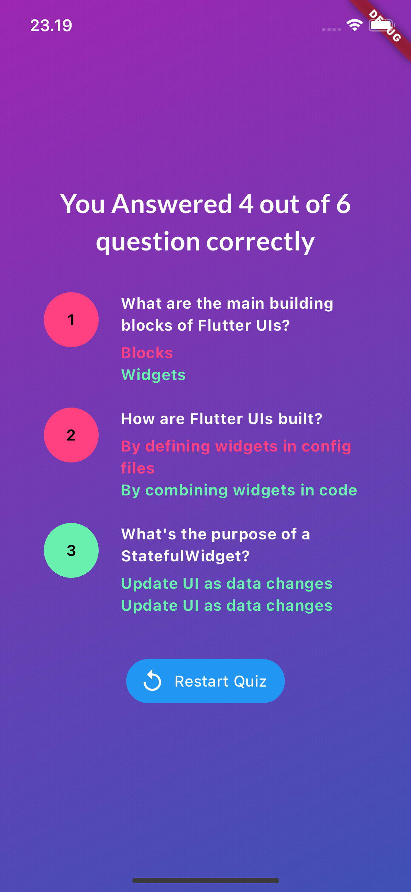

# quiz

Project simple quiz with 5 questions and 4 answers each. The user can choose only one answer for each question. The user can see the result of the quiz

## Installation

1. Clone the repository
2. Run `flutter pub get` to install the dependencies
3. Run `flutter run` to start the app

## Example of usage

    
    
    

